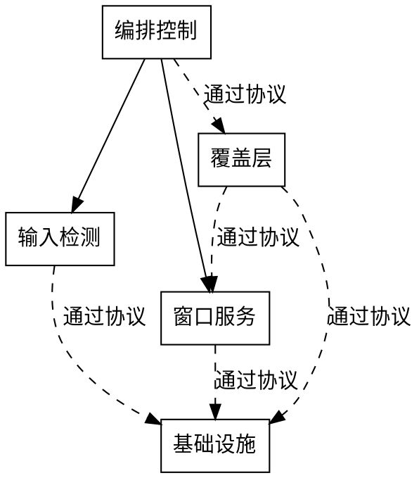

# Tidy 全局架构契约

> 最后更新：2026-07-28 | 版本：v0.1
> 文档状态：草案
> 契约状态：approved-baseline
> 适用范围：Tidy 仓库所有模块与功能的架构约束

本文档是 Tidy 项目的路线级架构契约，定义永远成立的不变量、模块分层、依赖方向和 ADR 流程。修订本契约中的任何不变量必须经 ADR 评审批准。

下游文档（功能级 Design、阶段需求等）引用本契约不变量编号（如 INV-001），不复制契约原文。

## 1. 概述

本契约回答四个问题：

1. 哪些不变量永远成立；
2. 模块如何分层；
3. 依赖朝哪个方向走；
4. 哪些决策需要 ADR 流程管控。

本契约只描述"什么永远成立"（Invariants），不描述"怎么实现"。类名、协议名、方法签名、字段类型、文件路径等属于 Implementation Plan，不属于本契约。

## 2. 路线级不变量

### INV-001：核心逻辑层永不依赖 UI 框架

纯逻辑模块（TidyCore）永不导入或链接任何 UI 框架。所有窗口枚举、布局算法、状态机逻辑和编排协调属于纯逻辑层，不得直接或间接依赖窗口覆盖层、状态栏或偏好窗口模块。

### INV-002：依赖方向必须单向，从 App → UI → Core

模块间依赖必须沿 App → UI → Core 方向流动。任何反向依赖或循环依赖都是禁止的。UI 层可以依赖 Core 层，但 Core 层不能依赖 UI 层或 App 层。

### INV-003：覆盖层模块坚持原生窗口框架，偏好窗口允许声明式框架

窗口覆盖层（字母标签、编排反馈）必须使用原生窗口框架实现，不得使用声明式 UI 框架。偏好设置窗口允许使用声明式 UI 框架作为内容区域。

### INV-004：编排控制与 UI 之间严格单向数据流

编排控制器向 UI 下发指令（排列、显示标签、隐藏覆盖层），UI 通过回调向控制器报告用户操作（字母选择、取消）。控制器不依赖 UI 的内部状态或渲染细节，UI 不直接操作窗口或修改编排状态。

### INV-005：窗口操作仅通过辅助功能公开接口

所有窗口枚举和操作（获取位置、设置位置、获取焦点窗口等）必须通过系统辅助功能公开接口完成。禁止使用任何私有系统调用或未文档化的系统内部接口。

### INV-006：状态机转换必须合法且可审计

编排状态机只能在已定义的合法状态之间转换。非法转换必须触发错误级日志，不得静默忽略。状态机转换必须可追踪，任何时刻都能确定当前状态和最近的转换历史。

### INV-007：输入拦截仅在编排选择阶段启用

键盘事件拦截功能只能在编排的选择阶段启用，其他阶段必须完全禁用。拦截功能不得影响正常的应用操作。拦截的生命周期必须与状态机严格绑定。

### INV-008：所有跨组件通信通过协议，不通过具体类型引用

模块之间的通信必须通过定义良好的协议进行，不得直接引用其他模块的具体类型。这确保模块可以独立测试和替换。

### INV-009：快照与还原必须成对且原子

编排过程中的窗口位置快照和还原必须成对出现。任何编排流程要么完整还原所有窗口，要么在还原失败时记录详细的失败信息并尝试部分还原。不得存在只有快照没有还原的编排流程。

### INV-010：权限缺失时不得执行窗口操作

在辅助功能权限未授权的情况下，不得执行任何窗口枚举或操作。权限检测必须在操作之前完成，检测结果的变化必须通过事件通知相关模块。

## 3. 分层结构

Tidy 采用三层架构：

| 层 | 职责 | 涉及业务模块 |
|---|---|---|
| Core 层 | 纯逻辑，不依赖任何 UI 框架；包含窗口枚举、布局算法、状态机、编排协调、权限检测、窗口操作 | M2 输入检测（逻辑部分）、M3 窗口服务、M4 编排控制 |
| UI 层 | 所有用户界面；包含覆盖层、状态栏、偏好窗口 | M1 基础设施（UI 部分）、M5 覆盖层 |
| App 层 | 应用入口与生命周期、依赖注入容器、全局协调 | M1 基础设施（入口与容器） |

### 业务模块映射

| 业务模块 | 职责 | 所属层 | 依赖 | 被依赖 |
|---------|------|-------|------|--------|
| 基础设施 | 应用入口、生命周期、依赖注入容器、状态栏 | App + UI | 无（App 部分）；Core 层（UI 部分） | 输入检测、窗口服务、编排控制、覆盖层 |
| 输入检测 | 全局热键注册、键盘事件拦截 | Core | 基础设施（通过协议） | 编排控制 |
| 窗口服务 | 窗口枚举、窗口操作、位置快照与还原 | Core | 基础设施（通过协议） | 编排控制、覆盖层 |
| 编排控制 | 状态机、激活/还原流程、选择输入处理 | Core | 输入检测、窗口服务、覆盖层（通过协议） | 无 |
| 覆盖层 | 窗口覆盖层、字母标签渲染 | UI | 基础设施（通过协议）、窗口服务（通过协议） | 编排控制（通过协议） |

## 4. 依赖方向

业务模块依赖图：

虚线箭头表示通过协议通信，不直接引用具体类型。

## 5. 禁止依赖方向

| 禁止规则 | 理由 |
|---------|------|
| Core 层禁止导入或链接 UI 框架 | INV-001：核心逻辑不依赖 UI |
| Core 层禁止依赖 UI 层的任何模块 | INV-002：依赖方向必须单向 |
| Core 层禁止依赖 App 层的任何模块 | INV-002：依赖方向必须单向 |
| UI 层禁止依赖 App 层的任何模块 | INV-002：依赖方向必须单向 |
| 覆盖层模块禁止使用声明式 UI 框架 | INV-003：覆盖层坚持原生窗口框架 |
| 编排控制器禁止依赖 UI 内部状态或渲染细节 | INV-004：单向数据流 |
| 窗口操作禁止使用私有系统调用 | INV-005：仅通过公开接口 |

## 6. Legacy Compatibility Surface

不适用（Greenfield 项目，无历史兼容义务）。

## 7. Target Public Surface

| 公共边界 | 稳定性承诺 | 验证策略 |
|---------|-----------|---------|
| Core 层对 UI 层提供的窗口枚举与操作协议 | 稳定：接口语义不变，实现可演进 | 单元测试覆盖 |
| Core 层对 UI 层提供的编排状态通知 | 稳定：状态类型和转换语义不变 | 状态机单元测试 |
| Core 层对 UI 层提供的输入事件协议 | 稳定：事件类型不变 | 输入检测单元测试 |
| App 层的依赖注入容器接口 | 演进中：P0 期间可能调整模块注册方式 | 编译验证 |

## 8. UI 框架分区

| 分区名 | 允许框架 | 涉及子模块 | 理由 |
|-------|---------|-----------|------|
| 覆盖层 | 原生窗口框架 | 字母标签覆盖层、编排反馈覆盖层 | 原生窗口框架与系统窗口层级的交互已验证；声明式 UI 框架与系统窗口面板集成存在已知兼容性问题 |
| 状态栏 | 原生窗口框架 | 状态栏图标与菜单 | 状态栏交互简单，原生框架直接支持 |
| 偏好窗口 | 原生窗口框架 + 声明式 UI 框架（仅内容区域） | 偏好设置窗口 | 偏好窗口交互简单，声明式框架已稳定；窗口外壳使用原生框架 |

## 9. ADR 流程与契约状态

### ADR 流程

1. **候选**：发现需要架构决策的问题，登记到 ADR 索引，创建候选 ADR 文件
2. **评审**：团队评审候选 ADR 的上下文、决策和影响
3. **批准**：评审通过后，ADR 状态改为"已批准"，补全影响与关联不变量
4. **登记**：已批准的 ADR 影响的不变量必须同步更新

**修订本契约中的任何不变量必须经 ADR 评审批准。** 未经 ADR 流程不得修改不变量。

### 契约状态

当前状态：`approved-baseline`

- 本契约已基于路线图和功能列表中的架构决策摘要建立
- P0 期间允许探索首批 ADR 主题
- F1 验证后可升级为 `frozen`

### 首批 ADR 候选

以下主题在 P0 期间探索，F1 期间验证后冻结：

1. 激活模型（单热键切换 vs 多激活方式）
2. 窗口范围（当前空间可见 vs 跨空间聚合）
3. 目标屏幕判定策略
4. 还原语义（撤销排列 vs 追踪工作阶段手动操作）
5. 输入拦截生命周期（仅选择阶段启用 vs 全程常驻）
6. 窗口操作失败处理（跳过加阈值终止 vs 原位置标签降级）
7. 偏好窗口技术选型
8. 字母标签位置策略
9. 输入监控权限必要性

## 版本记录

| 版本 | 日期 | 变更说明 |
|------|------|---------|
| v0.1 | 2026-07-28 | 建立全局架构契约草案；定义 10 条路线级不变量；三层架构分层；9 项首批 ADR 候选 |
