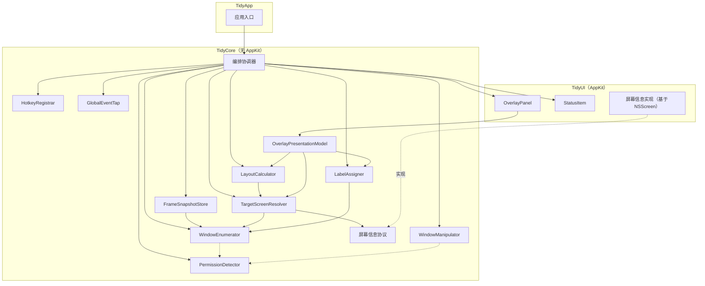
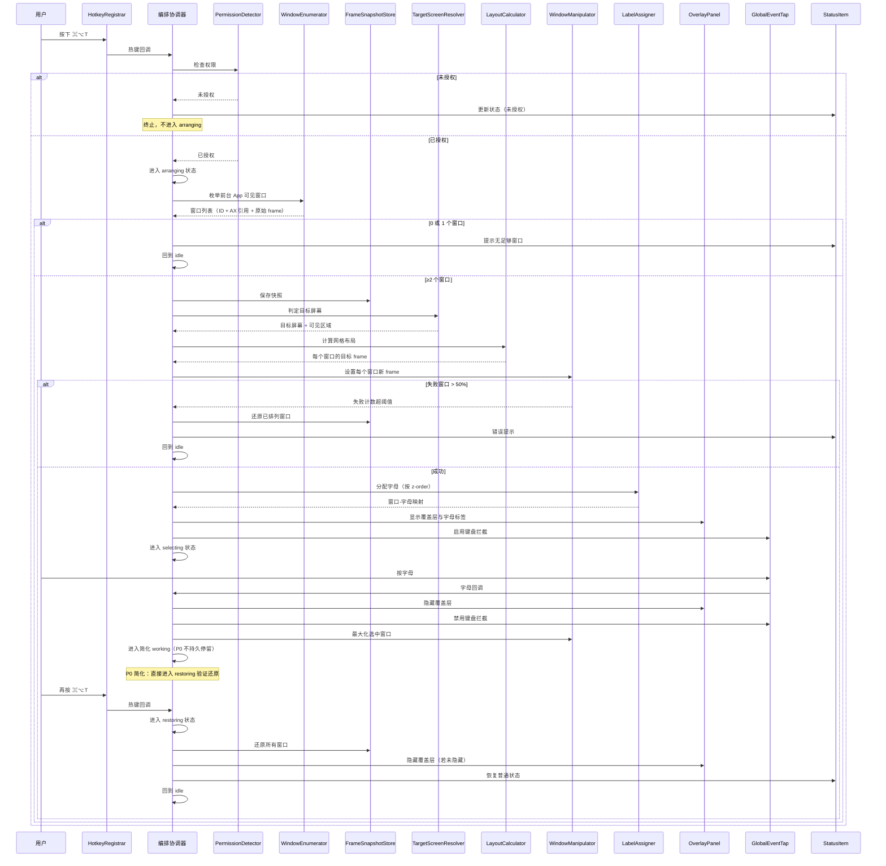
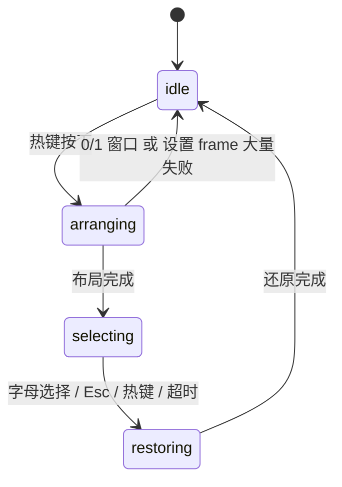

# P0_技术探针 设计文档

> 最后更新：2026-07-29 | 版本：v0.4
> 文档状态：草案
> 阶段定位：准备阶段（不参与 F 功能编号）

本文档是 P0_技术探针 阶段的架构契约，定义探针模块划分、依赖关系、数据流、状态机、错误回退与 SPM 骨架设计。需求与验收标准见同目录 [P0_01_阶段需求与验收](P0_01_阶段需求与验收.md)；技术验证项与项目骨架范围以 [docs.md](../../docs.md) 第 4.4 节为准；模块组织、状态机与 AX 行为细节参见 [Tidy 窗口管理 App 功能列表](../../Tidy%20窗口管理%20App%20功能列表.md)。

本文档只写架构契约（模块职责、依赖、数据流、状态、错误回退），不包含完整实现代码和逐文件任务（那是 `P0_04_实现计划.md` 的职责）。模块名属于架构契约，列出以明确职责边界；具体方法签名、字段类型、文件路径属于实现细节，由实现计划承载。

> **维度说明**：本文档中的"P0"指**准备阶段编号**；[Tidy 窗口管理 App 功能列表](../../Tidy%20窗口管理%20App%20功能列表.md)中的"P0/P1/P2"指**功能优先级**，是独立维度。

## 1. 模块划分

P0 探针按职责拆分为以下模块。模块划分参考功能列表 M1~M5 的分层，但 P0 探针阶段允许更扁平的组织以加速验证。模块名采用描述性命名，P0 期间允许与最终生产代码名不同；F1 阶段会基于验证结果正式化（见第 7 节迁移路径）。

每个模块说明"职责"与"不负责"，以及"依赖"与"被依赖"。依赖仅列直接依赖，传递依赖不重复。

### 1.1 权限与窗口服务层

#### PermissionDetector

- **职责**：检测辅助功能权限授权状态；监听授权状态变化（不轮询）。
- **不负责**：不引导用户授权（那是 F0 的职责）；不决定权限缺失时是否退出编排。
- **依赖**：无（仅系统框架）。
- **被依赖**：WindowEnumerator、WindowManipulator、编排协调器（操作前检查权限）。

#### WindowEnumerator

- **职责**：枚举前台 App 在当前 Space 上的所有可见窗口；将 CGWindowList 结果与 AX 窗口引用按 frame 匹配；输出窗口列表（含窗口 ID、AX 引用、原始 frame）。
- **不负责**：不决定哪些窗口参与排列（由编排协调器决定）；不操作窗口位置与大小。
- **依赖**：PermissionDetector（隐式，操作前需权限）。
- **被依赖**：FrameSnapshotStore、TargetScreenResolver、LabelAssigner、编排协调器。

#### WindowManipulator

- **职责**：通过 AX 设置窗口位置与大小；记录单个窗口设置失败；上报失败计数给编排协调器以决定是否终止。
- **不负责**：不决定目标 frame（由 LayoutCalculator 决定）；不保存快照（由 FrameSnapshotStore 决定）；不重试策略（由编排协调器决定）。
- **依赖**：PermissionDetector（隐式）。
- **被依赖**：编排协调器（排列、最大化与还原时调用）。

#### FrameSnapshotStore

- **职责**：保存排列前的窗口 frame 快照；提供快照查询接口；跳过已关闭窗口的记录。
- **不负责**：不决定何时保存与还原（由编排协调器决定）；不执行还原操作（由编排协调器读取快照后调用 WindowManipulator）；不持久化到磁盘（P0 仅内存）。
- **依赖**：WindowEnumerator（获取窗口引用与原始 frame）。
- **被依赖**：编排协调器。

#### TargetScreenResolver

- **职责**：获取前台 App 焦点窗口；计算焦点窗口中心所在屏幕；无焦点窗口时走兜底屏幕；输出目标屏幕标识与可见区域。
- **不负责**：不决定排列布局（由 LayoutCalculator 决定）；不操作窗口。
- **依赖**：WindowEnumerator（焦点窗口获取复用 AX 调用）；屏幕信息抽象（见 1.4，P0 通过协议由 TidyUI 注入 NSScreen 实现）。
- **被依赖**：LayoutCalculator、OverlayPresentationModel、编排协调器。

### 1.2 输入层

#### HotkeyRegistrar

- **职责**：注册 Carbon 全局热键（默认 ⌘⌥T）；热键按下时回调编排协调器；应用退出时注销热键；检测热键冲突。
- **不负责**：不决定热键按下后做什么（由编排协调器决定）；不拦截字母输入（那是 GlobalEventTap 的职责）。
- **依赖**：无（仅 Carbon 框架）。
- **被依赖**：编排协调器。

#### GlobalEventTap

- **职责**：创建 CGEventTap；按需启用 / 禁用键盘拦截；拦截超时禁用与用户输入禁用后自动恢复；恢复失败时通知编排协调器降级；仅 selecting 阶段启用（P0 简化：探针触发后启用，选择完成或还原后禁用）。
- **不负责**：不决定拦截到字母后做什么（由编排协调器决定）；不常驻（working 阶段不启用）。
- **依赖**：无（仅 CoreGraphics 框架）。
- **被依赖**：编排协调器。

### 1.3 UI 层

#### OverlayPresentationModel

- **职责**：封装覆盖层需要的所有展示数据，包括标签列表、位置信息和目标屏幕。
- **不负责**：不计算布局（由 LayoutCalculator 决定）；不分配字母（由 LabelAssigner 决定）。
- **依赖**：LayoutCalculator（窗口新 frame）、LabelAssigner（字母分配）、TargetScreenResolver（目标屏幕）。
- **被依赖**：OverlayPanel。

#### OverlayItem

- **职责**：描述单个标签的展示数据：字母、目标 frame、是否选中。
- **不负责**：不渲染（由 OverlayPanel 决定）；不计算位置。

#### OverlayPanel

- **职责**：创建 NSPanel 覆盖目标屏幕；渲染字母标签；淡入 / 淡出显示；不抢焦点、鼠标穿透；仅当前 Space 可见。OverlayPanel 只负责：给我 OverlayPresentationModel，我画。
- **不负责**：不决定标签位置与字母（由 LabelAssigner 与 LayoutCalculator 决定）；不处理业务逻辑。
- **依赖**：OverlayPresentationModel（标签与布局数据，由编排协调器构建）。
- **被依赖**：编排协调器。

#### StatusItem

- **职责**：显示状态栏图标；提供下拉菜单；菜单项点击回调编排协调器；P0 至少包含"退出"与"触发探针"两项。
- **不负责**：不决定图标状态（由编排协调器决定）；不渲染 4 种状态图标的完整交互（那是 F0.1 的职责）。
- **依赖**：无（仅 AppKit）。
- **被依赖**：编排协调器。

### 1.4 算法层

#### LayoutCalculator

- **职责**：根据窗口数量与屏幕长宽比计算自适应网格行列数；计算每个窗口的目标 frame；保证单元格不重叠、铺满可见区域；窗口数超过 26 时仅取前 26 并提示。
- **不负责**：不操作窗口（由 WindowManipulator 决定）；不分配字母（由 LabelAssigner 决定）。
- **依赖**：TargetScreenResolver（目标屏幕与可见区域）。
- **被依赖**：WindowManipulator（设置目标 frame）、OverlayPresentationModel（标签定位）。

#### LabelAssigner

- **职责**：按窗口 z-order 排序；按网格填充顺序分配 a-z 字母；最前窗口分配 `a`。
- **不负责**：不渲染标签（由 OverlayPanel 决定）；不决定网格顺序（由 LayoutCalculator 决定）。
- **依赖**：WindowEnumerator（z-order 信息）。
- **被依赖**：OverlayPresentationModel。

### 1.5 屏幕信息抽象（跨层协议）

P0 必须验证"依赖方向"ADR 主题：`TidyCore` 不依赖 AppKit，但 `TargetScreenResolver` 与 `LayoutCalculator` 需要屏幕可见区域（`NSScreen.visibleFrame` 属于 AppKit）。P0 采用协议抽象解决：

- `TidyCore` 定义屏幕信息协议（描述"提供屏幕列表与可见区域"的能力，不引入 AppKit 类型）；
- `TidyUI` 提供基于 `NSScreen` 的具体实现，注入 `TidyCore`；
- 编排协调器在初始化时注入屏幕信息实现。

这是 P0 对"依赖方向"ADR 主题的倾向方案，F1 验证后冻结为正式 ADR。

P0 必须在 TargetScreenResolver 内部明确 canonical coordinate system 的选择（建议统一使用 NSScreen 左下角原点坐标系作为 canonical，AX 和 CG 坐标转换到此系统后再比较）。P0 探针应记录坐标转换中发现的问题（负坐标、Retina scale、跨屏窗口等），F1 评估是否需要独立 CoordinateMapper 模块。

### 1.6 编排协调器

P0 探针需要一个协调器串联上述模块完成完整数据流。协调器不属于 M1~M5 的既有模块，是 P0 探针的临时组织单元，F1 阶段演化为正式的状态机控制器。

- **职责**：串联完整数据流（热键 → 枚举 → 快照 → 布局 → 设置 frame → 覆盖层 → 选择 → 最大化 → 还原）；维护简化 4 状态机；处理错误与降级；**性能埋点**（记录 T0/T1/T2 时间戳并输出到 `os_log`，供 P0 Exit Gate P95 验证）。
- **不负责**：不实现具体能力（委托各模块）；不持久化会话；不持久化性能数据到磁盘（P0 仅 `os_log` 输出，由人工或脚本收集）。
- **依赖**：HotkeyRegistrar、GlobalEventTap、WindowEnumerator、FrameSnapshotStore、LayoutCalculator、LabelAssigner、OverlayPanel、StatusItem、WindowManipulator、TargetScreenResolver、PermissionDetector。
- **被依赖**：TidyApp 入口。

> **性能埋点要求**（对应 [P0_01 5.1.1](P0_01_阶段需求与验收.md#51-性能测量协议)）：
> - `T0`：收到热键 callback 时刻（`activate()` 入口）
> - `T1`：所有窗口 `AXSetFrame` 完成时刻（`applyLayout` 结束）
> - `T2`：覆盖层与标签可见且可接受输入时刻（`overlayPanel.show` 完成 + `startKeyEventTap` 启用）
> - `Arrange latency = T2 - T0`，单位毫秒
> - 每次排列通过 `os_log` 输出：`tidy.performance app=<bundle_id> windows=<count> t0=<ms> t1=<ms> t2=<ms> latency=<ms> success=<0|1>`
> - 埋点不改变状态机行为，仅记录时间戳；失败路径也记录 T0 但 T1/T2 可缺失（记为 0），`success=0` 标识失败路径
> - `app` 字段取自编排协调器的 `frontmostBundleID` 属性，由 App 层从 `NSWorkspace.frontmostApplication?.bundleIdentifier` 注入

## 2. 模块依赖关系图

下图展示 P0 探针模块的直接依赖关系。箭头从依赖方指向被依赖方。



依赖关系说明：

- **编排协调器**是 P0 探针的中心枢纽，依赖所有模块以串联数据流；
- **WindowEnumerator** 与 **WindowManipulator** 对 **PermissionDetector** 是隐式依赖（操作前需权限，虚线表示）；
- **TargetScreenResolver** 依赖屏幕信息协议，由 TidyUI 的实现注入（跨层抽象）；
- **OverlayPresentationModel** 聚合 LayoutCalculator、LabelAssigner、TargetScreenResolver 的输出，OverlayPanel 仅依赖 OverlayPresentationModel（数据隔离）；
- **OverlayPanel** 与 **StatusItem** 位于 TidyUI，其余模块位于 TidyCore；
- **FrameSnapshotStore** 仅依赖 WindowEnumerator，不依赖 WindowManipulator（纯存储，还原由编排协调器执行）；
- **应用入口**位于 TidyApp，初始化编排协调器并注入屏幕信息实现。

## 3. 数据流

完整数据流从热键触发到还原结束，覆盖 P0 探针需要验证的所有环节。下图用序列图展示模块间交互。



数据流关键节点说明：

1. **热键触发**：HotkeyRegistrar 回调编排协调器，编排协调器先检查权限；
2. **窗口枚举**：WindowEnumerator 输出窗口列表，含窗口 ID、AX 引用与原始 frame；
3. **快照保存**：FrameSnapshotStore 保存原始 frame，供还原使用；
4. **目标屏幕判定**：TargetScreenResolver 基于焦点窗口中心判定目标屏幕；
5. **网格布局**：LayoutCalculator 根据窗口数量与屏幕长宽比计算目标 frame；
6. **设置 frame**：WindowManipulator 对每个窗口设置新 frame，失败时上报；
7. **覆盖层显示**：LabelAssigner 分配字母后，OverlayPanel 渲染字母标签；
8. **字母选择**：GlobalEventTap 拦截字母，回调编排协调器；
9. **最大化**：WindowManipulator 将选中窗口设置为目标屏幕可见区域；
10. **还原**：FrameSnapshotStore 按快照还原所有窗口。

> **P0 简化**：完整数据流中，最大化后的 working 阶段在 P0 不持久停留（探针直接进入 restoring 验证还原）。F1 阶段 working 状态会持久停留直到用户再次按热键，见第 4 节状态机说明。

## 4. 状态机

P0 探针采用**简化 4 状态机**用于流程控制，对应功能列表 5 状态机的子集。简化的目的是降低探针复杂度，聚焦技术验证；F1 阶段再完善为完整 5 状态。

### 4.1 P0 简化 4 状态

| 状态 | 含义 | 合法后继 | 内部子流程 |
|------|------|----------|-----------|
| `idle` | 探针未激活 | `arranging` | 等待热键 |
| `arranging` | 计算布局、保存快照、设置新 frame | `selecting` / `idle` | 枚举窗口 → 保存快照 → 计算网格 → 设置 frame → 显示覆盖层 → 启用 EventTap |
| `selecting` | 字母标签已渲染，等待用户输入 | `restoring` | 字母输入处理 → 最大化选中窗口 |
| `restoring` | 正在还原所有窗口 | `idle` | 设置所有窗口 frame 回快照值 → 隐藏覆盖层 → 禁用 EventTap |

### 4.2 状态转换

| 当前状态 | 触发 | 后继状态 |
|---------|------|---------|
| `idle` | Tidy 热键按下 | `arranging` |
| `arranging` | 布局完成 | `selecting` |
| `arranging` | 仅 0 或 1 个可见窗口 | `idle`（提示） |
| `arranging` | 设置 frame 大量失败（>50%） | `idle`（错误提示） |
| `selecting` | 有效字母按下 | `restoring`（P0 简化：最大化后直接还原） |
| `selecting` | Esc 按下 | `restoring` |
| `selecting` | Tidy 热键按下 | `restoring` |
| `selecting` | 超时（P0 探针可缩短） | `restoring` |
| `restoring` | 所有窗口 frame 已设置 | `idle` |

### 4.3 与 F1 完整 5 状态的差异

功能列表定义的完整 5 状态机为：`idle` / `arranging` / `selecting` / `working` / `restoring`。P0 简化版的差异：

| 差异点 | P0 简化版 | F1 完整版 |
|--------|-----------|-----------|
| `working` 状态 | 不存在；最大化后直接进入 `restoring` 验证还原 | 独立状态，用户在最大化窗口上工作，时长不定 |
| `selecting` 后继 | 直接 `restoring` | `working`（先最大化再切状态） |
| 前台 App 切换处理 | P0 探针不强制处理 | Session 保留，返回后 `working` 继续；目标 App 退出时尽力恢复 + 清理 Session |
| Space 切换处理 | P0 探针不强制处理 | 自动还原到 `restoring` |
| 超时 | 探针可缩短（如 5 秒）验证超时路径 | 默认 30 秒，可配置 |
| 状态机非法转换 | 断言 + 日志 | 断言 + 日志 + Error 级日志 |

P0 简化版不验证 `working` 阶段的"用户手动操作后还原语义"与"前台 App / Space 切换自动还原"，这些留待 F1。P0 只验证核心编排路径（枚举 → 布局 → 设置 frame → 选择 → 最大化 → 还原）的技术可行性。

### 4.4 状态机示意



## 5. 错误与回退

### 5.1 AX 设置 frame 失败处理

P0 必须验证两种失败处理策略的取舍（对应"AXSetFrame 失败处理"ADR 主题），倾向方案在 F1 冻结：

| 策略 | 行为 | 适用场景 | P0 验证重点 |
|------|------|----------|-------------|
| 跳过 + >50% 终止（功能列表方案） | 单个窗口失败跳过，不参与排列；失败窗口数超过半数则终止本次编排，显示错误通知 | 兼容性较好的 App 为主 | 成功率是否达 99%；终止阈值是否合理 |
| 原位置标签降级（市场调研报告方案） | 失败窗口保留原位置，在其可见区域显示标签，本次会话降级为"仅标签窗口切换器" | Logic Pro、Final Cut Pro 等兼容性较差的 App | 降级体验是否可用；标签是否可选中 |

P0 探针应同时实现两种策略的验证路径，记录兼容性矩阵中每个 App 的失败率与降级体验，供 F1 决策。两种策略的切换不影响状态机（均不离开 `arranging` / `selecting` 流程，仅影响排列结果与标签显示）。

### 5.2 CGEventTap 禁用恢复策略

CGEventTap 会被系统在超时或用户输入时禁用。P0 必须验证恢复策略（对应"CGEventTap 生命周期"ADR 主题）：

| 禁用原因 | P0 探针处理 |
|---------|-------------|
| 超时禁用 | 自动重新启用，记录 Info 日志 |
| 用户输入禁用 | 自动重新启用，记录 Info 日志 |
| 重新启用失败 | 退出 `selecting` 状态，还原所有窗口，显示错误提示，不崩溃 |

恢复失败是 P0 Exit Gate 必须验证的降级路径：探针不能因 CGEventTap 不可恢复而崩溃或卡在 `selecting` 状态。

### 5.3 窗口关闭与 App 退出处理

| 场景 | P0 探针处理 |
|------|-------------|
| 排列阶段窗口被关闭 | 跳过该窗口，不参与后续排列；快照中保留已关闭窗口记录 |
| 选择阶段窗口被关闭 | 该窗口字母失效，按无效字母处理（忽略，无反馈） |
| 还原阶段窗口已关闭 | 跳过该窗口（无法还原），记录 Info 日志，其他窗口正常还原 |
| 目标 App 退出 | 监听 App 终止通知，清理会话，能恢复的窗口尽力恢复 |
| 探针自身异常 | P0 不持久化快照，接受会话丢失；记录 Error 日志 |

### 5.4 权限缺失处理

| 场景 | P0 探针处理 |
|------|-------------|
| 触发编排时未授权 | 不进入 `arranging`，更新状态栏图标为未授权，记录日志 |
| 排列过程中权限被撤销 | AX 调用失败，按"设置 frame 大量失败"路径终止，记录 Error 日志 |
| 授权状态变化 | PermissionDetector 感知变化，更新内部状态，无需重启探针 |

## 6. SPM 三 target 骨架设计

P0 必须建立可编译的 SPM 三 target 骨架（对应"依赖方向"ADR 主题）。三 target 划分以 [docs.md](../../docs.md) 第 5 节 Standards 和本节为准。

### 6.1 Target 职责划分

| Target | 类型 | 职责 | 依赖 | 包含的 P0 模块 |
|--------|------|------|------|----------------|
| `TidyCore` | Library | 纯 Swift + 系统框架，无 AppKit；承载窗口枚举、AX 操作、布局算法、状态机、屏幕信息协议 | 系统框架（CoreGraphics、ApplicationServices、Carbon） | PermissionDetector、WindowEnumerator、WindowManipulator、FrameSnapshotStore、TargetScreenResolver、LayoutCalculator、LabelAssigner、OverlayPresentationModel、OverlayItem、HotkeyRegistrar、GlobalEventTap、屏幕信息协议、编排协调器 |
| `TidyUI` | Library | AppKit 覆盖层 + 未来承载偏好窗口的模块；P0 只建立 target，并实现 Overlay / StatusItem / ScreenProvider，不实现 Preferences UI + TidyCore | AppKit、SwiftUI、TidyCore | OverlayPanel、StatusItem、屏幕信息实现（基于 NSScreen） |
| `TidyApp` | macOS Application（Xcode Native Target） | 应用入口、生命周期、依赖注入 | TidyCore、TidyUI | 应用入口、依赖注入组装 |

> **架构决策**：TidyApp 采用 Xcode macOS Application Target 而非 SPM executableTarget。原因：App Bundle、Info.plist、TCC 权限声明、Menu Bar App 生命周期、Launch at Login、签名公证、XCUITest、Sparkle 自动更新等均需要 Xcode App Target 的原生支持。TidyCore / TidyUI 为 SPM Library，由 Xcode 项目引用 local package。

### 6.2 Package.swift 结构

以下展示 `Package.swift` 的 target 结构声明，仅包含 target 定义与依赖关系，不包含具体实现。完整文件由实现计划产出。

```swift
// Package.swift 结构声明（仅 target 定义，非完整实现）
let package = Package(
    name: "Tidy",
    platforms: [.macOS(.v12)],
    products: [
        .library(name: "TidyCore", targets: ["TidyCore"]),
        .library(name: "TidyUI", targets: ["TidyUI"]),
    ],
    targets: [
        .target(
            name: "TidyCore",
            dependencies: []  // 仅系统框架，无 AppKit
        ),
        .target(
            name: "TidyUI",
            dependencies: ["TidyCore"]  // AppKit + SwiftUI 由 SDK 隐式提供
        ),
        // TidyApp 为 Xcode macOS Application Target，不在 Package.swift 中声明
        // 由 Tidy.xcodeproj 管理，引用 local package Tidy（TidyCore + TidyUI）
        .testTarget(
            name: "TidyCoreTests",
            dependencies: ["TidyCore"]
        ),
        .testTarget(
            name: "TidyUITests",
            dependencies: ["TidyUI"]
        ),
    ]
)
```

### 6.3 依赖方向约束

P0 必须验证以下依赖方向约束（编译器层面保证）：

- `TidyCore` **不得** `import AppKit`（编译器拒绝）；
- `TidyUI` 可以 `import AppKit` / `import SwiftUI`，依赖 `TidyCore`；
- `TidyApp` 依赖 `TidyCore` 与 `TidyUI`，由 Xcode 项目管理依赖注入与构建；
- 跨层通信通过协议（如屏幕信息协议），不通过具体类型引用。

屏幕信息协议是 P0 验证依赖方向的关键抽象：`TidyCore` 定义协议描述"提供屏幕列表与可见区域"的能力，`TidyUI` 提供基于 `NSScreen` 的实现，`TidyApp` 在初始化时注入。这使 `TidyCore` 的 `TargetScreenResolver` 与 `LayoutCalculator` 能使用屏幕信息而不引入 AppKit。

### 6.4 SwiftLint 配置

`.swiftlint.yml` 位于仓库根目录，P0 完成时建立。配置要点：

- 启用 `--strict`（error 与 warning 级违规清零）；
- 第三方依赖与生成代码通过 `excluded` 排除（如 `.build/`、`Tests/`）；
- 规则集在 P0 探针期间允许迭代，最终规则由 `docs/standards/swift-rules.md` 维护。

具体规则配置由实现计划产出，本文档不展开。

## 7. 与 F1 架构的迁移路径

P0 探针代码不是丢弃式原型，应设计为可演化为 F1 生产代码。本节说明 P0 探针模块如何演化为 F1 的 M1~M5 模块组织（见功能列表第五节）。

### 7.1 模块演化映射

| P0 探针模块 | F1 归属（M1~M5） | 演化要点 |
|-------------|------------------|----------|
| PermissionDetector | M3 窗口服务 | 保留；F1 增加权限引导窗口联动（F0 协作） |
| WindowEnumerator | M3 窗口服务 | 保留；F1 增加窗口关闭监听 |
| WindowManipulator | M3 窗口服务 | 保留；F1 增加重试策略与按 App 调整 |
| FrameSnapshotStore | M3 窗口服务 | 保留；F1 评估是否持久化（v2） |
| TargetScreenResolver | M3 窗口服务 | 保留；F1 增加多屏聚合策略评估 |
| LayoutCalculator | M4 编排控制 | 保留；F1 增加自定义布局模板支持（F3） |
| LabelAssigner | M4 编排控制 | 保留；F1 增加双字符标签评估（>16 窗口） |
| HotkeyRegistrar | M2 输入检测 | 保留；F1 增加热键录制与配置（F1.6） |
| GlobalEventTap | M2 输入检测 | 保留；F1 增加 working 阶段不启用验证 |
| OverlayPanel | M5 覆盖层 UI | 保留；F1 增加字母标签视觉规格正式化（F1.3） |
| OverlayPresentationModel | M4 编排控制 | 保留；F1 评估是否与状态机控制器合并 |
| OverlayItem | M5 覆盖层 UI | 保留；F1 可能扩展标签交互属性 |
| StatusItem | M1 基础设施 | 保留；F1 增加 4 种图标状态与 5 项菜单（F0.1） |
| 编排协调器 | M4 编排控制（TidyModeController） | **重构**：从临时协调器演化为正式状态机控制器 |
| 屏幕信息协议 | M3 / M1 跨层 | 保留；F1 冻结为正式 ADR |

### 7.2 状态机演化

P0 简化 4 状态机演化为 F1 完整 5 状态机：

1. **新增 `working` 状态**：F1 在 `selecting` 后新增 `working`，用户在最大化窗口上工作，时长不定；
2. **新增会话保持与还原触发**：F1 监听前台 App 切换（Session 保留，返回后 working 继续）与 Space 切换（自动还原到 `restoring`）；目标 App 退出时尽力恢复 + 清理 Session；
3. **超时配置化**：F1 超时默认 30 秒，可配置（F1.6）；
4. **状态机非法转换处理**：F1 增加断言 + Error 级日志。

P0 探针的状态机实现应预留 `working` 状态的扩展点（如状态枚举预留位置、转换表可扩展），避免 F1 大规模重构。

### 7.3 探针代码保留与重构原则

- **保留**：权限检测、窗口枚举、AX 操作、布局算法、热键注册、EventTap、覆盖层、状态栏等模块的核心逻辑可直接进入 F1；
- **重构**：编排协调器需从临时组织演化为正式状态机控制器；探针的临时硬编码（窗口数量、App 列表、屏幕 ID）需替换为配置或运行时获取；
- **丢弃**：探针专用的临时触发方式（命令行参数、缩短超时）在 F1 移除。

### 7.4 验证证据复用

P0 产出的兼容性矩阵、性能基线、失败降级证据保存到 `artifacts/`，F1 可直接引用作为实现依据，无需重复技术探针。具体：

- 兼容性矩阵 → F1 的 AX 失败降级设计输入；
- 性能基线 → F1 的性能回归测试基准；
- ADR 倾向方案 → F1 验证后冻结为正式 ADR。

## 8. 版本记录

- **v0.4（2026-07-29）**
  - 第 1.6 节性能埋点 os_log 输出格式补充 `success=<0|1>` 字段，便于日志分析时直接过滤失败路径；
  - 明确 `app=<bundle_id>` 字段来源：编排协调器的 `frontmostBundleID` 属性，由 App 层从 `NSWorkspace.frontmostApplication?.bundleIdentifier` 注入；
  - 失败路径 T1/T2 缺失时记为 0，`success=0` 标识失败路径。

- **v0.3（2026-07-29）**
  - 第 1.6 节编排协调器职责补充性能埋点要求（T0/T1/T2 时间戳 + os_log 输出格式），对应 P0_01 5.1.1 性能测量协议；
  - 明确埋点不改变状态机行为，失败路径也记录 T0。

- **v0.2（2026-07-28）**
  - TidyApp 改为 Xcode macOS Application Target，从 Package.swift 移出，由 Tidy.xcodeproj 管理；
  - OverlayPanel 数据隔离：新增 OverlayPresentationModel 与 OverlayItem，OverlayPanel 仅依赖 OverlayPresentationModel；
  - FrameSnapshotStore 纯存储：移除还原执行职责与 WindowManipulator 依赖，由编排协调器负责还原；
  - App switching 新语义：F1 前台 App 切换改为 Session 保留 + 返回后 working 继续，目标 App 退出时尽力恢复 + 清理 Session；
  - 坐标转换策略：1.5 节新增 canonical coordinate system 选择要求与探针记录要求；
  - TidyUI 职责描述修正：P0 只建立 target 并实现 Overlay / StatusItem / ScreenProvider，不实现 Preferences UI；
  - 小修正：第 8 节引用→第 7 节、三 target 划分引用补充 Standards 和本节、SwiftLint 配置括号闭合。

- **v0.1（2026-07-28）**
  - 建立 P0_技术探针 设计文档草案；
  - 定义 12 个探针模块（PermissionDetector、WindowEnumerator、WindowManipulator、FrameSnapshotStore、TargetScreenResolver、HotkeyRegistrar、GlobalEventTap、OverlayPanel、StatusItem、LayoutCalculator、LabelAssigner、屏幕信息协议）+ 编排协调器，每个模块含职责、不负责、依赖、被依赖；
  - 提供 mermaid 模块依赖关系图，标注 TidyCore / TidyUI / TidyApp 三层归属；
  - 提供 mermaid 序列图展示完整数据流（热键 → 枚举 → 快照 → 布局 → 设置 frame → 覆盖层 → 选择 → 最大化 → 还原）；
  - 定义简化 4 状态机（idle / arranging / selecting / restoring），说明与 F1 完整 5 状态的差异（缺 working、缺自动还原触发、超时可缩短）；
  - 定义错误与回退：AX 设置 frame 失败两种策略（跳过 + >50% 终止 vs 原位置标签降级）、CGEventTap 禁用恢复（超时 / 用户输入 / 恢复失败降级）、窗口关闭与 App 退出处理、权限缺失处理；
  - 定义 SPM 三 target 骨架（TidyCore 无 AppKit / TidyUI AppKit+SwiftUI+TidyCore / TidyApp 入口），含 Package.swift 结构声明与依赖方向约束；
  - 定义与 F1 架构的迁移路径：模块演化映射、状态机演化、探针代码保留与重构原则、验证证据复用。
